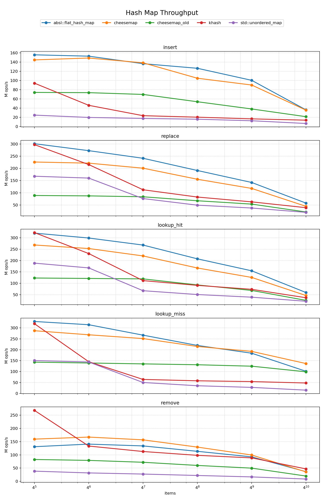

Cheesemap
=========

Cheesemap is a fast C++17 hash map and hash set. It uses a
Swiss-table-style open-addressing layout with control bytes, SIMD group probing
on SSE2 targets, and a scalar fallback.

Cheesemap is intentionally one public header-style source file:

    cheesemap.cc

It will stay that way.

Use it when you want a direct hash table and want to provide hashing and
equality functions yourself, along with an allocator that supplies allocation
and deallocation.

Cheesemap is designed for C-style C++ use. It does not try to integrate with
C++ object lifetime rules. There is no rule of three, rule of five, copy
constructor, move constructor, or automatic construction/destruction of stored
objects. Use types that tolerate that model. If a type needs constructors,
destructors, ownership hooks, or exception-safe movement, that is the caller's
problem.

Status
------

Cheesemap is not production-proven yet. That is the caveat.

It is not a work-in-progress placeholder. In the included integer-key
benchmarks it is close to Abseil `flat_hash_map`, the reference implementation
in this comparison, and it is ahead of the other implementations shown in most
of the chart.

The benchmark suite compares Cheesemap with `std::unordered_map`, Abseil
`flat_hash_map`, khash, and an older Cheesemap implementation.

Throughput from the current benchmark set:

Installation
------------

Cheesemap does not require a build system. Copy `cheesemap.cc` into your
project and include it.

The repository supports Bazel and CMake as well.

With Bazel:

    bazel build //:cheesemap

With CMake:

    cmake -S . -B build
    cmake --build build

Cheesemap requires C++17 or later. MSVC is not supported at this time.

Benchmarks
----------

The benchmark targets are under `benches/`.

With Bazel:

    bazel build //benches:cheesemap_bench
    bazel build //benches:abseil_bench
    bazel build //benches:std_unordered_map_bench
    bazel build //benches:khash_bench

The benchmarks measure insert, replace, hit lookup, miss lookup, and remove
throughput over table sizes from 1024 to 1048576 entries.

The chart above was produced through Bazel on WSL2 under Windows 11, using
native instructions and `-O2`. The machine used a 13th Gen Intel Core
i7-13850HX with normal CPU scaling enabled. It was not configured as a dedicated
benchmark machine; the numbers reflect whatever Windows scheduling and power
management did at the time. The runtime libc was GNU libc 6.

Use
---

Include `cheesemap.cc` and instantiate `cheesemap::Map` with key type, value
type, hash function, and equality function:

    using Map = cheesemap::Map<Key, Value, Hash, Equal>;

Allocation is supplied at runtime, not as a template parameter. Implement the
`cheesemap::IAllocator` interface and pass it by value to each operation that may
allocate or deallocate (`map_new_with`, `map_drop`, `map_reserve`, `map_insert`).
The map itself does not store the allocator. Operations take the map by pointer.

The basic operations are:

    cheesemap::map_new
    cheesemap::map_new_with
    cheesemap::map_drop
    cheesemap::map_reserve
    cheesemap::map_insert
    cheesemap::map_lookup
    cheesemap::map_remove

`cheesemap::Set` provides the same storage strategy for set membership.

Conventions
-----------

All declarations live in a single `cheesemap` namespace, so identifiers carry no
redundant prefix.

  - Types use `Ada_Case` (`Map`, `Probe_Sequence`, `Full_Iter`). The allocator
    interface is `IAllocator`.
  - Functions and function-like macros use `lower_case`. The two containers share
    the namespace, so their public operations keep a `map_`/`set_` qualifier
    (`map_insert`, `set_lookup`); internal helpers are unqualified (`group_load`,
    `find_insert_index`).
  - Enum constants use `Ada_Case` with no prefix (`Ctrl_Empty`, `Load_Num`).
  - Object-like macros use `SCREAMING_CASE` with a `CM_` prefix and are defined
    outside the namespace, since macros do not obey namespaces.
  - Integer types come straight from `<stdint.h>`/`<stddef.h>`; the library
    defines none of its own.
